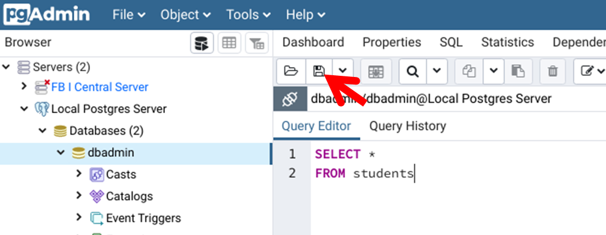
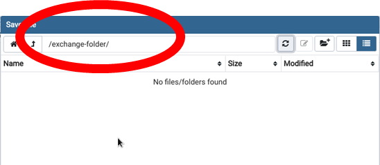

# Database Lab Environment

This is a very simple, quick, dirty, and ugly project that is supposed to help students to spin up a local database environment. This environnement can, for example be used to complete (most) lab exercises of my database lectures.

In fact, it is simply a [Docker Compose file](https://docs.docker.com/compose/) (plus some dockerfile) that allows you to quickly build and spin up containers on your local machine.  

The environment consists of:
1. **PostgreSQL**: database server ([link-1](https://en.wikipedia.org/wiki/PostgreSQL), [link-2](https://www.postgresql.org/)).
2. **pgAdmin4** as web-based database client for PostgreSQL. It has a very nice and powerful UI ([link](https://www.pgadmin.org/)). As part of this project, it already is prefigured to access the database above. 

If you are familiar with the usage of Docker Compose you will not need this, but if you are not, find some explainations on how to use this project below. 
 

## How to use this Project?!
### Precondition
1. Make sure you have a working version of Docker on your machine. Installation guide can be found [here](https://docs.docker.com/install/).
2. Make sure you have a working version of Docker Compose installed. Installation guide can be found [here](https://docs.docker.com/compose/install/).
3. Clone/Download this repository on your local machine. If necessary, get yourself familiar with Git [here](https://git-scm.com/).

In order to use the environment, execute the following commands in the local folder where you cloned the repository. Please, acknowledge in most cases, all commands must be executed with root privileges. 

### Initial Start the Environment
````
docker-compose up
````
Will start the environment. The first time (or after you removed them from your system) the containers will be created, downloaded to your system and started. 
Once the containers have started, you find the pgAdmin4 interface at [http://localhost:5050](http://localhost:5050). Use the following credentials to login:
- **User:** user@domain.com
- **Password:** secretpassword

In pgAdmin you will already see your local PostgreSQL database ready to be used. 


### Stop the Environment
````
docker-compose stop
````
Stops the containers for future use or removal.


### (Re-)Start the Environment
````
docker-compose start
````
Starts dormant the containers (containers that have previously run).

### Remove stopped Containers from your Machine
````
docker-compose rm
````
Once the containers are stopped, you can deleted them from your system. 


## Connect another Application to the Database
If you want to connect another application to the database, you need to connect to:
- **Server:** localhost:5432
- **Database:** dbadmin; new databases can of cause be created
- **User:** dbadmin
- **Password:** dbadminpassword

## Preconfigured User Credentials

The following are the standard credentials that are hard coded into the deployment process. You may want to create additional credential once you use the environment.

For the **database** the standard credentials are: 
- **User:** dbadmin
- **Password:** dbadminpassword

For the **pgAdmin** the standard credentials are: 
- **User:** user@domain.com
- **Password:** secretpassword

Please note: all above credentials are hard-coded into the deployment process at several places. Thus, if you feel like changing the credencials be sure to exit them in all necessary places (and, yes I know this is ugly).

## Exchanging Files between Host and pgAdmin

In the folder structure of this repository, there is place to exchange files (e.g. *.sql files) between the host and the pgAdmin container. 

### Preparation 

In order to have the **exchange-folder**-folder accessible from the pgAdmin container, you need to change the folders permissions.

In Linux you do that by executing:
````
chmod 777 exchange-folder
````

In Windows you do that by executing:

### Exchanging Files

In the folder structure of this repository you find a folder called **exchange-folder**.
Files in this folder can be accessed from both, the host and the pgAdmin container.

If you want to store a SQL-Script in pgAdmin and access ist from the host, please save it as a file in the exchange folder. 
This is done by clicking the save butten in the query tool. See screenshot:


Make sure all files that you want to access from the host are sorted in the **/exchange-folder/**-folder. 

See screenshot: 



You will now be able to access the file within your host's file system. 


Transfering files from the host to to pgAdmin works the same way. 

## Disclaimer
This project is in a quick-and-dirty state. Hard-coded credentials are ugly, bad, and evil. Enjoy!
